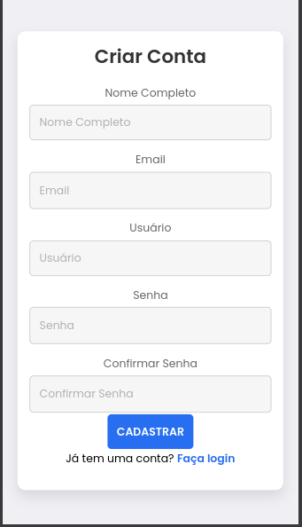
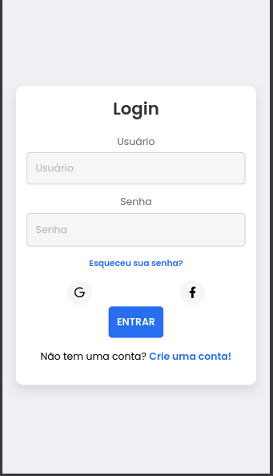
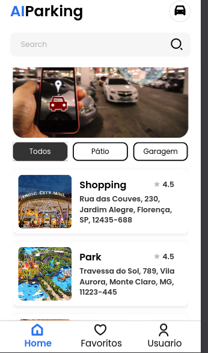
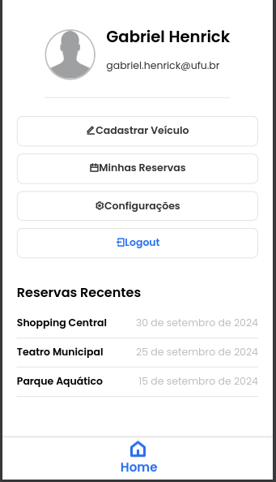
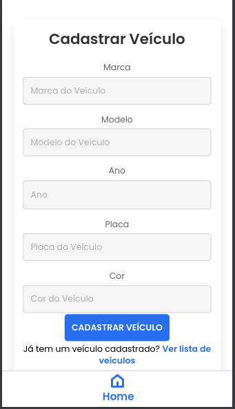
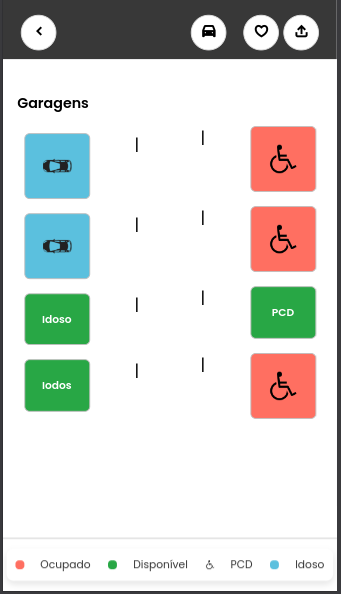
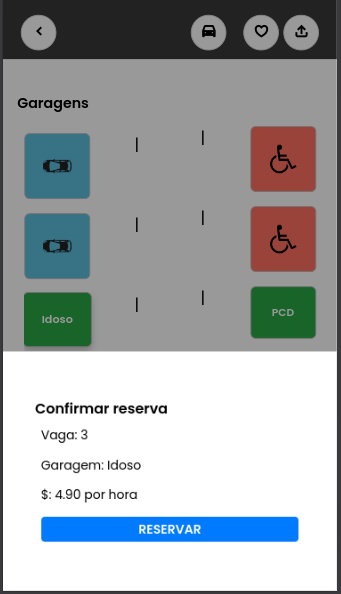

# Aplicativo de Reservas de Vagas de Estacionamento Assistido por IA

Este projeto é um aplicativo de reservas de vagas de estacionamento que utiliza inteligência artificial para otimizar a alocação de vagas e melhorar a experiência do usuário.

## 🚀 Funcionalidades Futuras (Roadmap)

- **Busca de Vagas em Tempo Real**  
  Planejado para permitir que usuários encontrem vagas disponíveis instantaneamente conforme sua localização.

- **Reservas Inteligentes por IA**  
  Algoritmos de IA irão sugerir automaticamente as melhores vagas com base em padrões de uso, horários e preferências.

- **Gestão Completa de Reservas**  
  Será possível visualizar, editar ou cancelar reservas diretamente pelo aplicativo.

- **Notificações Inteligentes**  
  Alertas automáticos sobre horário, mudanças de disponibilidade e outras atualizações importantes.

- **Interface Intuitiva e Modernizada**  
  Planejada para proporcionar navegação mais fluida, simples e otimizada.

## 🛠 Tecnologias Utilizadas

- **Front-end**: [Cordova](https://cordova.apache.org/)  
- **Back-end**: [Node.js](https://nodejs.org/) com [Express](https://expressjs.com/)  
- **Banco de Dados**: [PostgreSQL](https://www.postgresql.org/)  
- **Inteligência Artificial**: Modelos de Machine Learning para análise de dados e predição de vagas  

## Imagems

